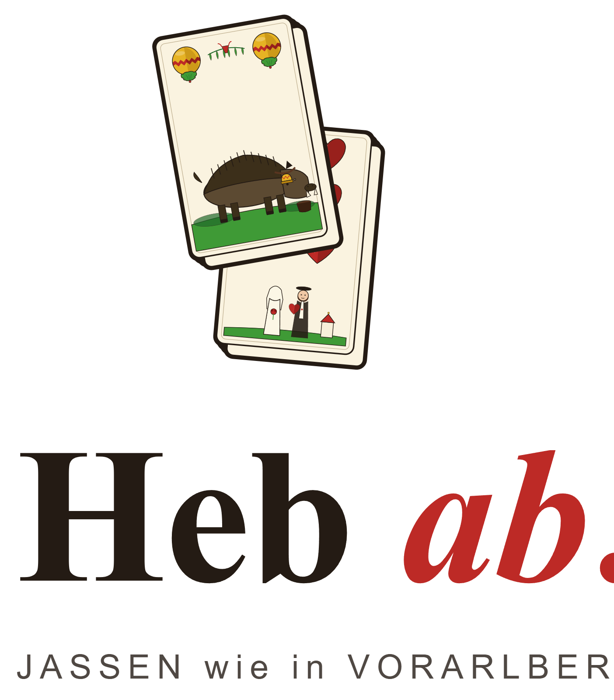

<p align="center">
  <picture>
    <source media="(prefers-color-scheme: dark)" srcset="assets/logo/lockup-gestapelt-dunkel-1600.png" />
    
  </picture>
</p>

# Heb ab!

> _Der OpenSource-Jass nach vorarlberger Spielart._

Selbst-hostbare Multiplayer-Plattform für **Vorarlberger Jass**, auf der echte Menschen gegen- und miteinander spielen — wahlweise mit KI-Gegnern in drei Stärkestufen. Die stärkste nutzt ein neuronales Netz aus dem Schwester-Projekt **[JCN9000](https://github.com/matthili/jcn9000)**. Das Projekt versteht sich zugleich als **Tech-Demo** für einen durchgehend aktuellen TypeScript-Stack.

> **Status:** Spielbar. Drei Varianten end-to-end — **Kreuz-Jass** (4 Spieler), **Solo-Jass** (4 Spieler), **Bodensee-Jass** (2 Spieler). Die komplette Plattform steht: Auth, Lobby, server-autoritatives WS-Gameplay, drei KI-Stufen, Chat (Lobby/Tisch/PN), Social-Layer (Freunde, Melden, Präsenz), Replays, Leaderboard, Admin-Panel, Web-Push, PWA, zweisprachig (DE-Vorarlberg + EN), drei Farbschemata. Den Werdegang erzählt [`docs/JOURNEY.md`](./docs/JOURNEY.md).

## Architektur auf einen Blick


Drei Apps, geteilte Pakete, ein Reverse-Proxy — server-autoritativ, mit der Spiel-Logik als externer Single Source of Truth. Details: [`docs/ARCHITECTURE.md`](./docs/ARCHITECTURE.md).

## Funktionsumfang

**Spiel**

- Drei Varianten mit eigener Engine-Logik, eigenem Scoreboard und eigenem NN-Modell: **Kreuz-Jass** (4P, 2 Teams), **Solo-Jass** (4P, jeder für sich), **Bodensee-Jass** (2P).
- **Server-autoritativ** über WebSockets — Clients sehen nur die eigene Hand, Schummeln ist clientseitig nicht möglich.
- Vollständige Vorarlberger Regeln: echtes **Abheben**, **WELI**-Ansager, **Weisen**, **Stöck**, **Matsch**, **Sack**-Regel, sowie die Ansage-Varianten Trumpf/Gumpf/Oben/Unten/**Slalom**.
- **Drei KI-Stufen:** Zufall (Üben), regelbasierte **Heuristik** (Standard-Gegner, inkl. Trumpf-Disziplin), und das trainierte **neuronale Netz** (TF.js, ein Modell je Spielart).
- **Disconnect-Handling** (mehrstufige Abstimmung bzw. Reconnect-Schonfrist mit KI-Übernahme) und **Re-Match**-Flow.
- Spiel-**Cinematics**: Mischen/Abheben/Verteilen, WELI-Enthüllung, Stich-Auflösung, Matsch.

**Lobby & Soziales**

- **Lobby + Tische** mit drei Beitritts-Modi (offen / auf Anfrage / nur Einladung), KI-Auffüllung, Owner-Aktionen.
- **Chat** in Lobby, am Tisch und als Privatnachricht — Markdown-light + serverseitige Sanitization, Wortfilter.
- **Social-Layer:** klickbare Namen → Kontextmenü, Freunde-Flow, Melden (Report), Online-Präsenz (4 Status + AFK), PN-Empfangsrechte + Per-Sender-Block, Profil-Konversations-History.
- **Web-Push** (VAPID) für Beitritts-Anfragen.

**Rund ums Spiel**

- **Replays** (öffentlich teilbar, Opt-in pro Partie), **Leaderboard** (Opt-in) und Basis-Statistiken pro Variante.
- **Admin-Panel:** SMTP, Blocklist, Chat-Wortfilter, User-Management, Audit-Log, Report-Review, globale Lobby-Einstellungen, Tisch-Übersicht (verwaiste Tische auflösen).
- **DSGVO:** pro-Feld-Sichtbarkeit, Daten-Export, Soft-Delete mit Anonymisierung; **Erst-Admin-Bootstrap** für frische Installationen.
- **PWA**-installierbar, **i18n** (DE-Vorarlberg + EN), drei Farbschemata (hell/dunkel/hoch­kontrast), WCAG-2.1-AA-Ziel.

## Tech-Stack (Highlights)

| Schicht          | Wahl                                                               |
| ---------------- | ------------------------------------------------------------------ |
| Monorepo         | pnpm 10 workspaces + Turborepo                                     |
| Sprache          | TypeScript 5 strict                                                |
| Frontend-Spiel   | React 19 + Vite 8 + TanStack Router/Query + Tailwind 4 + Zustand 5 |
| Frontend-Landing | Astro 6 + React-Islands                                            |
| Backend          | NestJS 11 + Fastify 5                                              |
| API-Stil         | REST (OpenAPI aus Zod) + WebSocket (Socket.IO)                     |
| DB               | PostgreSQL 16 + Prisma 7                                           |
| Cache/Pub-Sub    | Redis 7 (+ Socket.IO-Redis-Adapter)                                |
| Auth             | Better Auth + Argon2id (`@node-rs/argon2`) + HIBP-Check + Zod 4    |
| KI-Inferenz      | eigener Microservice mit `@tensorflow/tfjs` (pure-JS)              |
| Reverse Proxy    | Caddy 2 (Auto-TLS, HSTS, CSP)                                      |
| Container        | Docker Compose (Dev/NAS) + Helm (k8s)                              |

Vollständige Begründung pro Schicht: [`docs/ARCHITECTURE.md`](./docs/ARCHITECTURE.md).
Bewusste Stack-Abweichungen vom Ursprungsplan: [`docs/JOURNEY.md`](./docs/JOURNEY.md).

## Quickstart (lokal entwickeln)

> Voraussetzungen: **Node ≥22 < 25**, **pnpm 10+**, **Docker** (für Postgres + Redis), optional **gh CLI** (für den NN-Modell-Download).

```powershell
pnpm install
pnpm import:cards        # migriert jasskarten-assets/ → assets/cards/

# Optional: NN-Modelle aus dem Schwester-Repo holen (für die stärkste KI-Stufe).
# Ohne diesen Schritt laufen Zufalls- und Heuristik-KI trotzdem.
pnpm sync:nn             # gh release download → external/jass-nn/
pnpm verify:nn           # Manifest- + Hash-Verifikation

# Infrastruktur (Postgres + Redis) als Docker-Container:
pnpm dev:stack           # hochfahren   (Stop: pnpm dev:stack:stop)
pnpm dev:stack:nn        # optional: zusätzlich den Inferenz-Service

# Alle Apps im Watch-Modus (api + web + landing + inference):
pnpm dev
```

Die Web-App läuft danach unter dem von Vite ausgegebenen Port. Den **ersten Admin** richtet eine frische Installation per Umgebungsvariable bzw. CLI ein (kein DB-Gefummel nötig).

Weitere nützliche Skripte:

```powershell
pnpm typecheck     # Workspace-übergreifender TS-Check
pnpm lint          # ESLint über alle Pakete
pnpm test          # Unit- + Integration-Tests (Vitest + Testcontainers)
pnpm gen:openapi   # OpenAPI-Doc aus den Zod-Schemas erzeugen
```

## Repository-Layout

```
.
├── apps/
│   ├── landing/        # Astro-Site (Marketing, Jass-Schule, Recht)
│   ├── web/            # React-PWA (Spiel, Lobby, Chat, Replays)
│   ├── api/            # NestJS-Backend (REST + Socket.IO, autoritativ)
│   └── inference/      # @tensorflow/tfjs Microservice (KI-Züge)
├── packages/
│   ├── engine/         # TS-Port der Jass-Engine + State-Encoder
│   ├── shared-types/   # Zod-Schemas → OpenAPI-Client + WS-Events
│   ├── ui/             # geteilte React-Komponenten (Card/Hand/Trick/…)
│   └── config/         # tsconfig-/eslint-/prettier-Basis
├── assets/
│   ├── cards/          # Karten-PNGs (migriert von jasskarten-assets/)
│   ├── diagrams/        # PlantUML-Quellen + gerenderte PNGs
│   └── logo/           # Logo-Lockups (hell/dunkel)
├── external/jass-nn/   # NN-Artefakt — via `pnpm sync:nn` (gitignored)
├── infra/              # docker-compose, caddy, helm, k6, watchdog
├── scripts/            # import-cards, sync-nn, verify-nn-manifest
└── docs/               # ARCHITECTURE, JOURNEY, NN-CONTRACT, SECURITY, ADRs
```

## Schwester-Projekt: JCN9000

Spielregeln, Encoding-Spezifikation und die trainierten Modelle kommen aus dem unabhängigen Python-Projekt **JCN9000**:

- **Repo:** [`matthili/jcn9000`](https://github.com/matthili/jcn9000)
- **Wie integriert:** versionierter Artefakt-Download, gepinnt in `package.json#jassNn` — siehe [`docs/NN-CONTRACT.md`](./docs/NN-CONTRACT.md).

Die Web-App **dupliziert Spielregeln nicht** — Single Source of Truth ist `external/jass-nn/jass_rules.json`; der TS-Port der Engine wird gegen die Python-Fixtures byte-equivalent verifiziert.

## Dokumentation

| Dokument                                         | Inhalt                                                           |
| ------------------------------------------------ | ---------------------------------------------------------------- |
| [`docs/ARCHITECTURE.md`](./docs/ARCHITECTURE.md) | Schichten, Datenfluss, konkrete Versionen, Diagramme             |
| [`docs/JOURNEY.md`](./docs/JOURNEY.md)           | Werdegang + bewusste Abweichungen vom Ursprungsplan              |
| [`docs/NN-CONTRACT.md`](./docs/NN-CONTRACT.md)   | Schnittstelle zu JCN9000: Artefakte, Versionierung, Verifikation |
| [`docs/SECURITY.md`](./docs/SECURITY.md)         | Sicherheits-Checkliste + Threat-Model                            |
| [`docs/ADRs/`](./docs/ADRs/)                     | Architecture Decision Records                                    |

## Lizenz

**GNU Affero General Public License v3.0 only** (`AGPL-3.0-only`) — siehe [`LICENSE`](./LICENSE).

Kurz: Nutzen, studieren, weitergeben und verändern ist erlaubt. Wer eine **veränderte** Version betreibt — auch als Netzwerk-Dienst (also diese Web-App auf einem Server) — muss seinen Nutzern den vollständigen Quellcode der veränderten Version unter derselben Lizenz zugänglich machen (AGPL §13).
