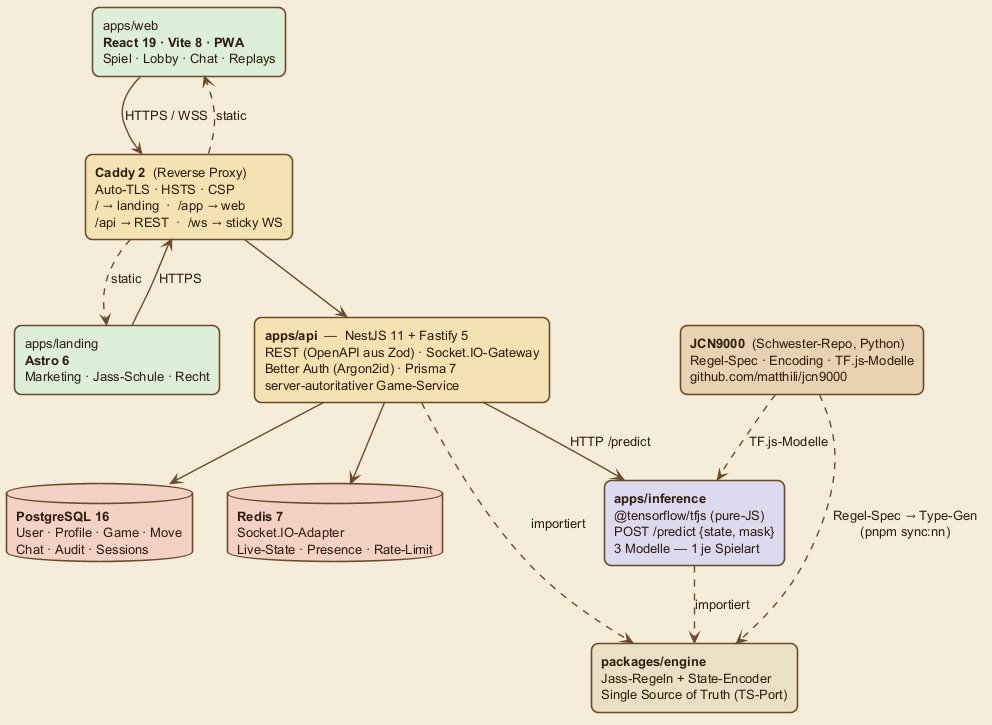
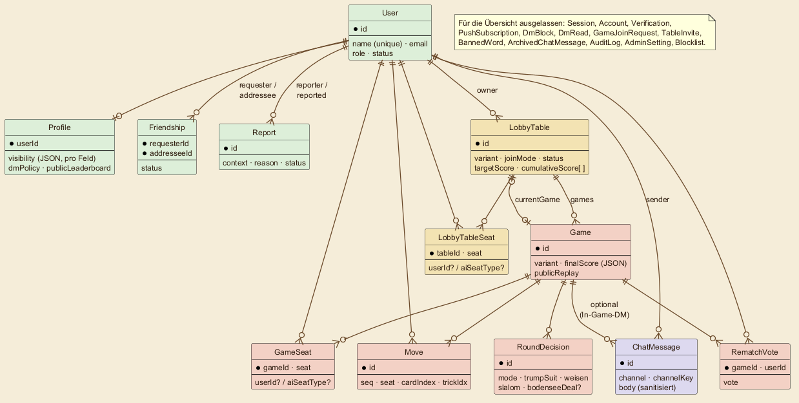
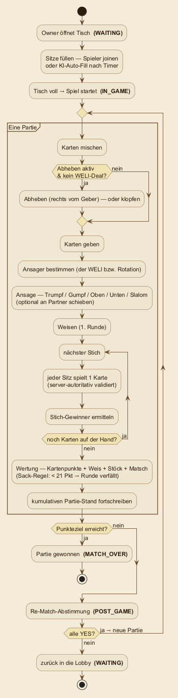

# Architektur — Heb ab!

> Lebendes Dokument. Projektname: **„Heb ab!"** — der OpenSource-Jass nach vorarlberger Spielart. Detaillierte Entscheidungsbegründungen stehen in den [ADRs](./ADRs/).

## Überblick

Drei Apps, vier Pakete, ein Reverse-Proxy:



> Quelle des Diagramms: [`assets/diagrams/architecture.puml`](../assets/diagrams/architecture.puml) — gerendert mit PlantUML (helle „Karte", damit es auf GitHub hell wie dunkel lesbar bleibt).

- **`apps/landing/`** — Astro-Site für Marketing, Regeln, Datenschutz, Impressum. Statisch gebaut, React-Islands für interaktive Demos.
- **`apps/web/`** — React-SPA (das eigentliche Spiel + Lobby). PWA-installierbar.
- **`apps/api/`** — NestJS-Backend (REST + Socket.IO-Gateway). Server-autoritativer Spielzustand.
- **`apps/inference/`** — Fastify-Microservice mit `@tensorflow/tfjs` (pure-JS, kein nativer tfjs-node-Build) für die KI-Züge. Lädt pro Spielart ein eigenes Modell.

Geteilte Logik:

- **`packages/engine/`** — TS-Port der Jass-Regeln + State-Encoder, Quelle der Wahrheit für API _und_ Inference. Variantenspezifische Encoder: Kreuz/Solo `v3.0.0` (421-dim), Bodensee `bodensee_1.0.0` (291-dim). Abgeglichen gegen die Python-Engine im Schwester-Repo.
- **`packages/shared-types/`** — geteilte **Zod-Schemas** als Single Source of Truth für REST-DTOs (FE + BE leiten daraus ab) + Generator für ein OpenAPI-Doc (`pnpm gen:openapi`).
- **`packages/ui/`** — Card, Hand, Trick, Scoreboard, ChatBubble.
- **`packages/config/`** — geteilte tsconfig-/eslint-/prettier-Basis.

## Schichtarchitektur

```
┌─────────────────────────────────────────────────────────────────────────┐
│  Browser (PWA, React+Vite) — apps/web                                   │
│  ├─ TanStack Router/Query                                               │
│  ├─ Socket.IO Client                                                    │
│  └─ Service Worker (offline shell, card assets cached)                  │
│                                                                          │
│  Marketing — apps/landing (Astro)                                       │
└──────────┬──────────────┬───────────────────────────────────────────────┘
           │ HTTPS         │ WSS
           ▼              ▼
┌─────────────────────────────────────────────────────────────────────────┐
│  Caddy Reverse Proxy                                                    │
│  - Auto-TLS, HSTS, CSP                                                  │
│  - /             → landing (static)                                     │
│  - /app/*        → web (SPA fallback)                                   │
│  - /api/*        → api (round-robin)                                    │
│  - /ws/*         → api (sticky ip_hash)                                 │
└──────────┬───────────────────────────────────────┬──────────────────────┘
           ▼                                       ▼
┌─────────────────────────────┐         ┌──────────────────────────────┐
│  apps/api (NestJS+Fastify)  │         │  apps/web + apps/landing      │
│  ├─ REST Controllers        │         │  (statisch via Caddy)         │
│  ├─ Socket.IO Gateway       │         └──────────────────────────────┘
│  ├─ Better Auth (Sessions PG)│
│  ├─ Prisma Client           │
│  ├─ Game Service (autorit.) │
│  └─ Inference HTTP Client ──┼─────┐
└──────────┬───────────────┬──┘     │
           ▼               ▼        ▼
┌────────────────┐ ┌──────────────────┐ ┌────────────────────────────────┐
│ PostgreSQL 16  │ │ Redis 7          │ │ apps/inference                 │
│ - User/Profile │ │ - Socket.IO Adp  │ │ - @tensorflow/tfjs (pure-JS)   │
│ - Game/Move    │ │ - Live GameState │ │ - POST /predict {state, mask}  │
│ - ChatMessage  │ │ - Presence Sets  │ │ - Multi-Modell + Vers.-Check   │
│ - AuditLog     │ │ - Rate-Limit     │ │                                │
│ - Sessions     │ │ - Chat-Stream    │ └────────────────────────────────┘
└────────────────┘ └──────────────────┘
```

Datenmodell, Auth-Flow und KI-Integration im Detail: siehe das Prisma-Schema
(`apps/api/prisma/schema.prisma`), die ADRs unten und [`NN-CONTRACT.md`](./NN-CONTRACT.md).

## Datenmodell

Kuratierter Ausschnitt des Prisma-Schemas — der Gameplay- und Social-Kern. Auth-Plumbing (Session/Account/…) und Admin-Tabellen sind für die Übersicht ausgeblendet; vollständig steht alles in [`apps/api/prisma/schema.prisma`](../apps/api/prisma/schema.prisma).



Kurz gelesen: ein **User** hat ein **Profile** (Sichtbarkeit pro Feld), eröffnet **LobbyTables** und sitzt über **LobbyTableSeat** an Tischen. Ein Tisch hat viele **Games** (+ genau ein aktuelles); jedes Game hat **GameSeats**, **Moves** (jede gespielte Karte), **RoundDecisions** (Ansage/Weisen/Slalom je Runde) und **RematchVotes**. Sozial: **Friendship** und **Report** sind Selbst-Relationen über `User`; **ChatMessage** trägt den Kanal (Lobby/Tisch/PN) und optional eine Game-Verknüpfung.

## Spiel-Loop

Wie eine Partie abläuft — von „Tisch offen" bis „gewonnen", mit dem Stich-Loop innen und dem Partie-/Re-Match-Loop außen. Die fett gesetzten Zustände sind Werte von `LobbyTableStatus`.



## Tech-Stack (konkrete Versionen)

| Schicht          | Wahl                                                                                        |
| ---------------- | ------------------------------------------------------------------------------------------- |
| Monorepo / Build | pnpm 10 workspaces, Turborepo, TypeScript 5.7, Node ≥22 <25                                 |
| Backend          | NestJS 11 + Fastify 5, Socket.IO 4.8 (+ Redis-Adapter)                                      |
| ORM / DB         | Prisma 7 (`@prisma/adapter-pg`) auf PostgreSQL 16                                           |
| Auth             | Better Auth 1.6, Argon2id (`@node-rs/argon2`), Zod 4, HIBP-Pwned-Check                      |
| Cache / Live     | Redis 7 (Socket.IO-Adapter, Live-GameState, Presence, Rate-Limit)                           |
| Frontend-Spiel   | React 19, Vite 8, Tailwind 4, TanStack Router/Query, Zustand 5, i18next 26, vite-plugin-pwa |
| Frontend-Landing | Astro 6 + React-Islands                                                                     |
| KI-Inferenz      | Fastify + `@tensorflow/tfjs` 4 (pure-JS), ein Modell je Spielart                            |
| Spielvarianten   | KREUZ_4P, SOLO_4P, BODENSEE_2P (KREUZ_6P / KREUZ_STEIGERN reserviert)                       |
| Geteilte Pakete  | `engine` (Regeln + Encoder), `shared-types` (Zod + OpenAPI), `ui`, `config`                 |
| Web-Push         | `web-push` (VAPID), optional                                                                |
| Reverse Proxy    | Caddy 2 (Auto-TLS, HSTS, CSP)                                                               |
| Container        | Docker Compose (Dev/NAS) + Helm-Chart (k8s)                                                 |
| Tests            | Vitest 4 (Unit), Testcontainers 11 (Integration), Playwright (E2E)                          |

## Tech-Stack-Entscheidungen — Verweis auf ADRs

| Entscheidung                             | ADR                                                  |
| ---------------------------------------- | ---------------------------------------------------- |
| pnpm + Turborepo statt Nx                | [0001](./ADRs/0001-monorepo-pnpm-turborepo.md)       |
| REST + WS statt tRPC                     | [0002](./ADRs/0002-rest-and-ws-not-trpc.md)          |
| Better Auth statt Lucia/Auth.js/Passport | [0003](./ADRs/0003-lucia-not-authjs.md)              |
| Inferenz als eigener Microservice        | [0004](./ADRs/0004-inference-as-separate-service.md) |

## Sicherheit

Siehe [`SECURITY.md`](./SECURITY.md) für die Checkliste, was ab welchem Meilenstein eingebaut wird.

## NN-Schnittstelle

Siehe [`NN-CONTRACT.md`](./NN-CONTRACT.md) für die exakte Schnittstelle zum Schwester-Projekt: Welche Artefakte werden konsumiert, wie versioniert, wie verifiziert.

## Werdegang

Den erzählten Entwicklungs-Verlauf inkl. der bewussten Stack-Abweichungen vom
Ursprungsplan findest du in [`JOURNEY.md`](./JOURNEY.md).
