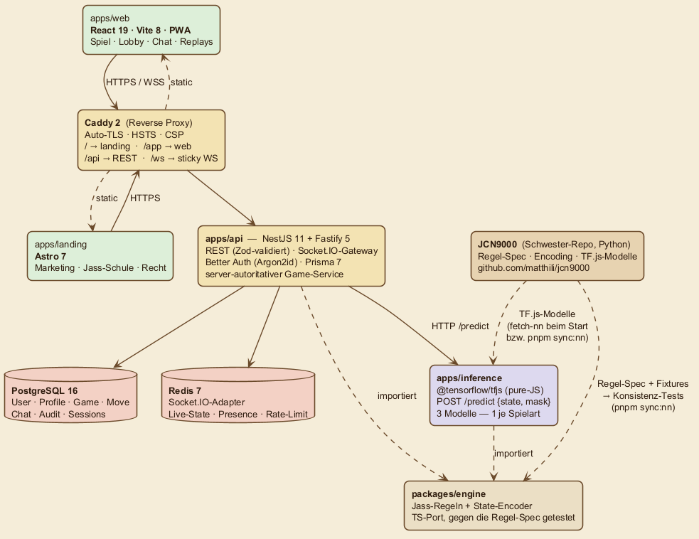
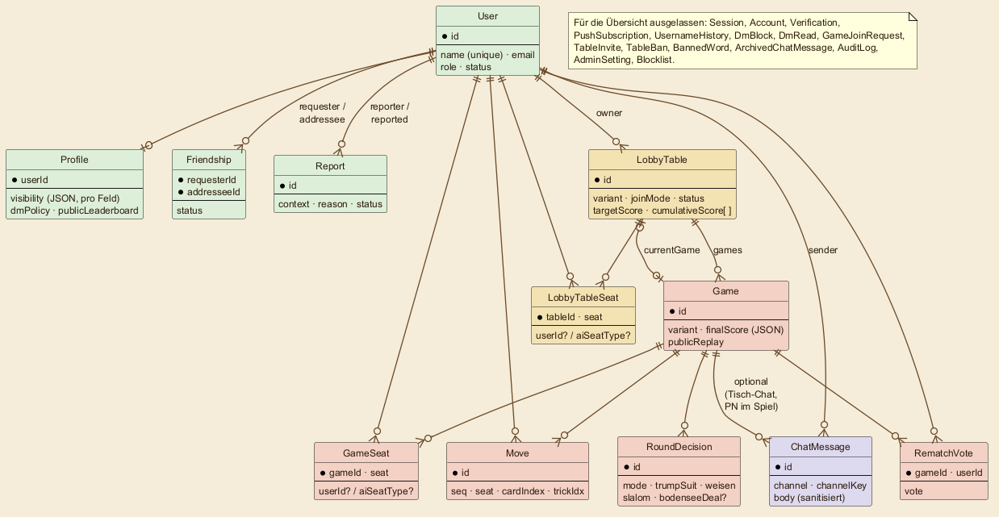
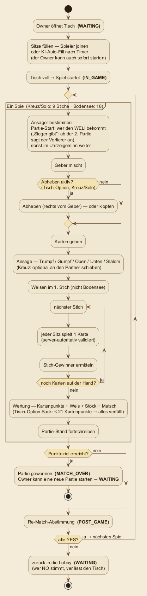

# Architektur — Heb ab!

> Lebendes Dokument. Projektname: **„Heb ab!"** — der OpenSource-Jass nach vorarlberger Spielart. Detaillierte Entscheidungsbegründungen stehen in den [ADRs](./ADRs/).

## Überblick

Vier Apps, vier Pakete, ein Reverse-Proxy:



> Quelle des Diagramms: [`assets/diagrams/architecture.puml`](../assets/diagrams/architecture.puml) — gerendert mit PlantUML (helle „Karte", damit es auf GitHub hell wie dunkel lesbar bleibt).

- **`apps/landing/`** — Astro-Site (DE/EN) für Startseite, Jass-Schule (Regeln), Über, Datenschutz, Impressum. Statisch gebaut, React-Islands für interaktive Demos.
- **`apps/web/`** — React-SPA (das eigentliche Spiel + Lobby). PWA-installierbar.
- **`apps/api/`** — NestJS-Backend (REST + Socket.IO-Gateway). Server-autoritativer Spielzustand.
- **`apps/inference/`** — Fastify-Microservice mit `@tensorflow/tfjs` (pure-JS, kein nativer tfjs-node-Build) für die KI-Züge. Lädt pro Spielart ein eigenes Modell.

Geteilte Logik:

- **`packages/engine/`** — TS-Port der Jass-Regeln + State-Encoder, Quelle der Wahrheit für API _und_ Inference. Variantenspezifische Encoder: Kreuz/Solo `v3.0.0` (421-dim), Bodensee `bodensee_1.0.0` (291-dim). Abgeglichen gegen die Python-Engine im Schwester-Repo.
- **`packages/shared-types/`** — geteilte **Zod-Schemas** für die Lobby-Verträge (FE + BE leiten daraus ab), die KI-Namen und ein Generator für ein OpenAPI-Dokument daraus (`pnpm gen:openapi` → `openapi.json`). Die übrigen REST-DTOs liegen als Zod-Schemas in `apps/api` (`*.dto.ts`).
- **`packages/ui/`** — Card, Hand, Trick, Scoreboard.
- **`packages/config/`** — geteilte tsconfig-/eslint-/prettier-Basis.

## Schichtarchitektur

```
┌─────────────────────────────────────────────────────────────────────────┐
│  Browser (PWA, React+Vite) — apps/web                                   │
│  ├─ TanStack Router/Query                                               │
│  ├─ Socket.IO Client                                                    │
│  └─ Service Worker (offline shell, card assets cached)                  │
│                                                                          │
│  Marketing — apps/landing (Astro)                                       │
└──────────┬──────────────┬───────────────────────────────────────────────┘
           │ HTTPS         │ WSS
           ▼              ▼
┌─────────────────────────────────────────────────────────────────────────┐
│  Caddy Reverse Proxy                                                    │
│  - Auto-TLS, HSTS, CSP                                                  │
│  - /             → landing (static)                                     │
│  - /app/*        → web (SPA fallback)                                   │
│  - /api/*        → api                                                  │
│  - /ws*          → api (lb_policy ip_hash = sticky, prod/tunnel)        │
│  - /healthz      → api                                                  │
└──────────┬───────────────────────────────────────┬──────────────────────┘
           ▼                                       ▼
┌─────────────────────────────┐         ┌──────────────────────────────┐
│  apps/api (NestJS+Fastify)  │         │  apps/web + apps/landing      │
│  ├─ REST Controllers        │         │  (nginx-Container, statisch)  │
│  ├─ Socket.IO Gateway       │         └──────────────────────────────┘
│  ├─ Better Auth (Sessions PG)│
│  ├─ Prisma Client           │
│  ├─ Game Service (autorit.) │
│  └─ Inference HTTP Client ──┼─────┐
└──────────┬───────────────┬──┘     │
           ▼               ▼        ▼
┌────────────────┐ ┌──────────────────┐ ┌────────────────────────────────┐
│ PostgreSQL 16  │ │ Redis 7          │ │ apps/inference                 │
│ - User/Profile │ │ - Socket.IO Adp  │ │ - @tensorflow/tfjs (pure-JS)   │
│ - Game/Move    │ │ - Live GameState │ │ - POST /predict {state, mask}  │
│ - ChatMessage  │ │ - Presence Sets  │ │ - Multi-Modell + Vers.-Check   │
│ - AuditLog     │ │ - Rate-Limit     │ │                                │
│ - Sessions     │ │ - Chat-Stream    │ └────────────────────────────────┘
└────────────────┘ └──────────────────┘
```

Datenmodell, Auth-Flow und KI-Integration im Detail: siehe das Prisma-Schema
(`apps/api/prisma/schema.prisma`), die ADRs unten und [`NN-CONTRACT.md`](./NN-CONTRACT.md).

## Datenmodell

Kuratierter Ausschnitt des Prisma-Schemas — der Gameplay- und Social-Kern. Auth-Plumbing (Session/Account/…) und Admin-Tabellen sind für die Übersicht ausgeblendet; vollständig steht alles in [`apps/api/prisma/schema.prisma`](../apps/api/prisma/schema.prisma).



Kurz gelesen: ein **User** hat ein **Profile** (Sichtbarkeit pro Feld), eröffnet **LobbyTables** und sitzt über **LobbyTableSeat** an Tischen. Ein Tisch hat viele **Games** (+ genau ein aktuelles); jedes Game hat **GameSeats**, **Moves** (jede gespielte Karte), **RoundDecisions** (Ansage/Weisen/Slalom je Runde) und **RematchVotes**. Sozial: **Friendship** und **Report** sind Selbst-Relationen über `User`; **ChatMessage** trägt den Kanal (Lobby/Tisch/PN) und optional eine Game-Verknüpfung.

## Spiel-Loop

Wie ein Tisch läuft — von „Tisch offen" bis „Partie gewonnen": innen der Stich-Loop eines Spiels, außen der Re-Match-Loop von Spiel zu Spiel, bis ein Team (bzw. bei Solo ein Spieler) das Punkteziel erreicht. Eine **Partie** sind also mehrere Spiele bis zum Punkteziel. Die fett gesetzten Zustände sind Werte von `LobbyTableStatus`.



## Tech-Stack (konkrete Versionen)

| Schicht          | Wahl                                                                                        |
| ---------------- | ------------------------------------------------------------------------------------------- |
| Monorepo / Build | pnpm 12 workspaces, Turborepo, TypeScript 5.9, Node ≥22 <25                                 |
| Backend          | NestJS 11 + Fastify 5, Socket.IO 4.8 (+ Redis-Adapter)                                      |
| ORM / DB         | Prisma 7 (`@prisma/adapter-pg`) auf PostgreSQL 16                                           |
| Auth             | Better Auth 1.7, Argon2id (`@node-rs/argon2`), Zod 4, HIBP-Pwned-Check                      |
| Cache / Live     | Redis 7 (Socket.IO-Adapter, Live-GameState, Presence, Rate-Limit)                           |
| Frontend-Spiel   | React 19, Vite 8, Tailwind 4, TanStack Router/Query, Zustand 5, i18next 26, vite-plugin-pwa |
| Frontend-Landing | Astro 7 + React-Islands                                                                     |
| KI-Inferenz      | Fastify + `@tensorflow/tfjs` 4 (pure-JS), ein Modell je Spielart                            |
| Spielvarianten   | KREUZ_4P, SOLO_4P, BODENSEE_2P (KREUZ_6P / KREUZ_STEIGERN reserviert)                       |
| Geteilte Pakete  | `engine` (Regeln + Encoder), `shared-types` (Zod + OpenAPI), `ui`, `config`                 |
| Web-Push         | `web-push` (VAPID), optional                                                                |
| Reverse Proxy    | Caddy 2 (Auto-TLS, HSTS, CSP)                                                               |
| Container        | Docker Compose (Dev/NAS) + Helm-Chart (k8s)                                                 |
| Tests            | Vitest 4 (Unit), Testcontainers 11 (Integration), Playwright (E2E)                          |

## Betrieb & Skalierung

| Stack               | Datei                               | Dienste                                                         | Zweck                                                   |
| ------------------- | ----------------------------------- | --------------------------------------------------------------- | ------------------------------------------------------- |
| Dev                 | `infra/docker-compose.dev.yml`      | Postgres, Redis, Mailhog, Inferenz (nur mit Profil `nn`)        | lokale Entwicklung; die Apps laufen per `pnpm dev`      |
| Self-Host (LAN)     | `infra/docker-compose.selfhost.yml` | Postgres, Redis, API, Web, Landing, Caddy, Backup, Autoheal     | ein Befehl, HTTP, Konten schaltet der Admin frei        |
| Tunnel (öffentlich) | `infra/docker-compose.tunnel.yml`   | wie Self-Host + Inferenz + Watchdog                             | Cloudflare Tunnel (TLS), Turnstile, E-Mail-Verifikation |
| Prod                | `infra/docker-compose.prod.yml`     | wie Tunnel; Caddy holt Let's-Encrypt-Zertifikate (Ports 80/443) | eigene Domain mit offenen Ports                         |
| Kubernetes          | `infra/helm/jass-app/`              | API, Inferenz, Web, Landing, Ingress (Postgres/Redis extern)    | Cluster-Betrieb                                         |

Anleitungen: [`SELFHOST.md`](./SELFHOST.md), Backups und Restore in [`infra/backup/README.md`](../infra/backup/README.md), Ausfall-Alarm in [`infra/watchdog/README.md`](../infra/watchdog/README.md).

**Skalierung:** Die API ist derzeit auf **eine Instanz** ausgelegt. Der Spiel-Lock (`GameLockService`) und die Timer der Disconnect-Abstimmung liegen im Speicher des Prozesses. Socket.IO-Redis-Adapter und Spielzustand in Redis sind für mehrere Instanzen vorbereitet; vor einem Betrieb mit mehreren API-Repliken braucht es aber einen verteilten Lock und verteilte Timer (so vermerkt in `game-lock.service.ts` und `disconnect-vote.service.ts`). Der Inferenz-Dienst ist zustandslos und lässt sich beliebig vervielfachen.

## Tech-Stack-Entscheidungen — Verweis auf ADRs

| Entscheidung                             | ADR                                                  |
| ---------------------------------------- | ---------------------------------------------------- |
| pnpm + Turborepo statt Nx                | [0001](./ADRs/0001-monorepo-pnpm-turborepo.md)       |
| REST + WS statt tRPC                     | [0002](./ADRs/0002-rest-and-ws-not-trpc.md)          |
| Better Auth statt Lucia/Auth.js/Passport | [0003](./ADRs/0003-lucia-not-authjs.md)              |
| Inferenz als eigener Microservice        | [0004](./ADRs/0004-inference-as-separate-service.md) |

## Sicherheit

Siehe [`SECURITY.md`](./SECURITY.md) für die umgesetzten Kontrollen (mit Fundstelle im Code) und das Threat-Model.

## NN-Schnittstelle

Siehe [`NN-CONTRACT.md`](./NN-CONTRACT.md) für die exakte Schnittstelle zum Schwester-Projekt: Welche Artefakte werden konsumiert, wie versioniert, wie verifiziert.

## Werdegang

Den erzählten Entwicklungs-Verlauf inkl. der bewussten Stack-Abweichungen vom
Ursprungsplan findest du in [`JOURNEY.md`](./JOURNEY.md).
