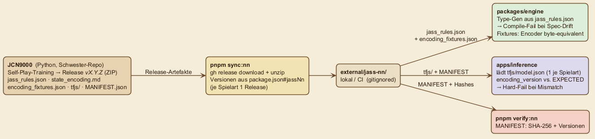

# NN-Schnittstelle zum Schwester-Projekt (JCN9000)

Die Web-App importiert Spiel-Logik und Modelle aus dem unabhängigen Python-Projekt **[JCN9000](https://github.com/matthili/jcn9000)** (`matthili/jcn9000`) — als versionierte Release-Artefakte, **nie** als duplizierten Code.



| Artefakt              | Pfad nach Sync                              | Zweck                                                                   |
| --------------------- | ------------------------------------------- | ----------------------------------------------------------------------- |
| **Regel-Spec**        | `external/jass-nn/jass_rules.json`          | Quelle für `packages/engine/src/types.ts` (Type-Gen) + alle Spielregeln |
| **Encoding-Spec**     | `external/jass-nn/state_encoding.md`        | Referenz-Doku für `packages/engine/src/encoder.ts`                      |
| **Encoding-Fixtures** | `external/jass-nn/encoding_fixtures.json`   | Verifikations-Tests für TS-Encoder (byte-equivalent)                    |
| **TF.js-Modell**      | `external/jass-nn/<spielart>/tfjs/`         | Geladen vom `apps/inference`-Service — ein Modell je Spielart           |
| **MANIFEST**          | `external/jass-nn/<spielart>/MANIFEST.json` | Version, Hashes, encoding_version, spec_version                         |

## Versionierung — drei Modelle, eines je Spielart

Jede Spielart hat ihr eigenes Modell mit eigener Version und eigenem Encoder. Die Pins stehen in `package.json#jassNn`:

```json
"jassNn": {
  "repo": "matthili/jcn9000",
  "models": {
    "kreuz":    { "version": "v0.7.2", "encodingVersion": "3.0.0",          "specVersion": "1.2.0" },
    "solo":     { "version": "v0.8.2", "encodingVersion": "3.0.0",          "specVersion": "1.2.0" },
    "bodensee": { "version": "v0.9.2", "encodingVersion": "bodensee_1.0.0", "specVersion": "1.2.0" }
  }
}
```

- **Kreuz** und **Solo** teilen den Encoder `3.0.0` (421-dim), haben aber je ein eigenes, separat trainiertes Modell.
- **Bodensee** (2 Spieler) nutzt einen eigenen Encoder `bodensee_1.0.0` (291-dim).
- `pnpm sync:nn` lädt für jede Spielart den gepinnten Release und legt ihn unter `external/jass-nn/<spielart>/` ab.

## Sync-Workflow

```powershell
# 1. JCN9000 veröffentlicht je Spielart ein Release-ZIP mit:
#    tfjs/, jass_rules.json, state_encoding.md, encoding_fixtures.json, MANIFEST.json

# 2. Web-Repo: lokal oder in CI
pnpm sync:nn       # gh release download + unzip → external/jass-nn/<spielart>/
pnpm verify:nn     # Manifest- + SHA-256- + Versions-Verifikation

# 3. Engine-Type-Generierung:
pnpm --filter @jass/engine build
```

## Konsistenz-Garantien

**Drift wird verhindert** durch:

- **Type-Gen** aus `jass_rules.json` — jede Spec-Änderung erzeugt neue TS-Types → Compile-Fail, wenn der Code nicht nachgezogen wird.
- **Fixture-Tests** gegen `encoding_fixtures.json` — jede Encoder-Änderung schlägt fehl, sobald die Vektoren nicht mehr byte-equivalent sind.
- **`MANIFEST.encoding_version`** muss exakt der `EXPECTED_ENCODING_VERSION` in `packages/engine` entsprechen, sonst Hard-Error beim Modell-Boot in `apps/inference`.

## Modell-Updates

Ein neues Modell für eine Spielart wird so eingespielt:

1. JCN9000 veröffentlicht `vX.Y.Z` für die Spielart.
2. Web-Repo-PR: `package.json#jassNn.models.<spielart>.version` (+ ggf. `encodingVersion`/`specVersion`) auf den neuen Stand setzen.
3. `pnpm sync:nn && pnpm verify:nn && pnpm test`.
4. Bei Tests-grün: Merge. Der Container-Build greift in den neuen Pin.

> **Achtung Encoder-Bump:** Bei einem `encodingVersion`-Wechsel (Breaking Change im Encoder) müssen TS-Port (`encoder.ts`) und Fixture-Tests parallel angepasst werden — der Spec-/Encoder-Test in `packages/engine` schlägt sonst sofort fehl.

## Status der Pipeline

Aktuell gepinnt: **Kreuz `v0.7.2`**, **Solo `v0.8.2`**, **Bodensee `v0.9.2`** (alle Spec `1.2.0`).

| Komponente                                  | Status                                                  |
| ------------------------------------------- | ------------------------------------------------------- |
| Python-Engine + Tests im Schwester-Repo     | ✅ vorhanden                                            |
| `jass_rules.json` (spec_version 1.2.0)      | ✅ stabil über alle drei Modelle                        |
| Encoder Kreuz/Solo `3.0.0` (421-dim)        | ✅ TS-Port byte-equivalent gegen Fixtures               |
| Encoder Bodensee `bodensee_1.0.0` (291-dim) | ✅ eigener Encoder + eigene Fixtures                    |
| TF.js-Modelle (1 je Spielart)               | ✅ in den jeweiligen Releases, vom Hash-Check abgedeckt |
| `pnpm sync:nn` (Download + SHA-Verify)      | ✅ produktiv, je Spielart ein Release                   |

### Encoder-Version-History (Kreuz/Solo)

| Version   | Featurevektor | Wesentliche Änderung                                                                                                                |
| --------- | ------------- | ----------------------------------------------------------------------------------------------------------------------------------- |
| 1.0.0     | 132 dims      | Initiales Layout, History nicht spielerspezifisch                                                                                   |
| 2.0.0     | 348 dims      | Spielerspezifische History (per Sitz aufgeschlüsselt) — übersprungen im Web-Repo                                                    |
| **3.0.0** | **421 dims**  | + `value_per_card` (36) + `strength_per_card` (36) vorberechnet; `mode` 4 → 5 Bits (`is_gumpf`); `trump_suit`-Onehot auch bei GUMPF |

Bodensee nutzt einen eigenständigen Encoder `bodensee_1.0.0` (291 dims) für das 2-Spieler-Spiel.

### Spielvarianten / Ansage-Modi (Spec 1.2.0)

| ID          | Trumpf? | Stich-Reihenfolge                  | Wertpunkte              | Buur-Ausnahme | Note                                                  |
| ----------- | ------- | ---------------------------------- | ----------------------- | ------------- | ----------------------------------------------------- |
| `trumpf`    | ja      | normal in Lead                     | Buur=20, Nell=14        | aktiv         | Klassisch                                             |
| **`gumpf`** | **ja**  | **invertiert in Lead (non-trump)** | **wie Trumpf**          | **aktiv**     | **Hybrid: Trumpf-Farbe trumpf-like, Rest geiss-like** |
| `oben`      | nein    | normal                             | 8er=8                   | —             | Bock                                                  |
| `unten`     | nein    | invertiert                         | 8er=8                   | —             | Geiss                                                 |
| `slalom`    | nein    | wechselt OBEN ↔ UNTEN              | je nach aktuellem Modus | —             | Slalom darf NICHT mit Gumpf kombiniert werden         |
